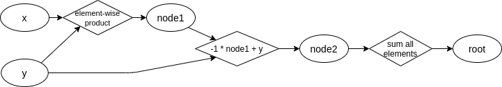

# antra

Lightweight package for defining computation graphs and performing intervention experiments

## Table of Contents

* [antra](#antra)
  * [Table of Contents](#table-of-contents)
  * [Installation and dependencies](#installation-and-dependencies)
  * [Basic Usage](#basic-usage)
  * [Defining a computation graph](#defining-a-computation-graph)
     * [Converting a torch.nn.Module into a subclass of ComputationGraph](#converting-a-torchnnmodule-into-a-subclass-of-computationgraph)
  * [Basic computation](#basic-computation)
  * [Interventions](#interventions)
     * [Setting up an intervention](#setting-up-an-intervention)
     * [Computing the intervention](#computing-the-intervention)
  * [Interventions on specific indices and slices of vectors/tensors](#interventions-on-specific-indices-and-slices-of-vectorstensors)
     * [Specifying intervention location as a string](#specifying-intervention-location-as-a-string)
     * [Specifying intervention location using the LOC object](#specifying-intervention-location-using-the-loc-object)
     * [Computing interventions with specified indexing location](#computing-interventions-with-specified-indexing-location)
     * [How this works under the hood](#how-this-works-under-the-hood)
  * [Batched computation and intervention](#batched-computation-and-intervention)
  * [Caching control](#caching-control)
  * [Value caching and keys](#value-caching-and-keys)
  * [Abstracted computation graphs](#abstracted-computation-graphs)

## Installation and dependencies

Install `antra` using `pip`:

```
$ pip install antra
```

`antra` is implemented using vanilla Python 3, and its basic usage doesn't depend on other packages.

`antra`'s batch operations require `pytorch`. Its installation instructions can be found [here](https://pytorch.org/get-started/locally/).

## Basic Usage

`antra`'s main functionality is to perform efficient interventions on computation processes, which is
essential for the causal analysis of a program or algorithm (see [section below](#interventions) on interventions).

Using `antra`, users can declaratively construct a computation graph that implements a computation process of interest. 
The computation graph contains nodes, which can either be a *leaf*, which serve as the input points of the graph, 
or can represent a function, which takes in the output values of other nodes as inputs and returns a  value. 
The computation graph must be a directed acyclic graph, and must have one single *root* node which outputs the final result of 
the entire graph.

Each node in the computation graph contains an internal `dict` that caches 
the result for different inputs, making it efficient to access intermediate values in the graph and intervene on the 
computation graph, at the expense of extra memory space.

`antra` is lightweight and flexible. It is agnostic to the input and output types as well as the content
of each node's functions. Optionally, if you have `pytorch` installed, `antra` can perform computations 
and interventions in batches, which is useful for analyzing numerically intensive systems such as neural networks.

Note that `antra`'s primary purpose is to provide a lightweight scaffolding to convert an algorithm/program/computation process
into a computation graph and perform interventions on it. It does not perform back-propogation on its own.

## Defining a computation graph

To define a computation graph, first define the nodes in it using `antra.GraphNode` by specifying each node's `name`,
and for non-leaf nodes, its function (called its `forward` function) and its children nodes, who provide input values
to the function's arguments.

After defining the nodes, pass in the root node to the `antra.ComputationGraph` constructor, to construct the 
computation graph.

In the following we use an example to explain how to construct a computation graph using `antra`.

For instance, suppose we have the following graph that takes in two vectors `x` and `y` as inputs:



Which can be expressed in equations as:

```
node1 = x * y   // element-wise product
node2 = -1 * node1 + y
root = node2.sum(dim=-1)
```

We can define the graph using `antra` as:

```python
from antra import GraphNode, ComputationGraph

x = GraphNode.leaf("x")
y = GraphNode.leaf("y")

node1_f = lambda x, y: x * y
node1 = GraphNode(x, y, name="node1", forward=node1_f)

node2_f = lambda z, y: -1 * z + y
node2 = GraphNode(node1, y, name="node2", forward=node2_f)

root_f = lambda r: r.sum(dim=-1)
root = GraphNode(node2, name="root", forward=root_f)

g = ComputationGraph(root)
```
Note that the `GraphNode` constructor takes in an arbitrary number of positional arguments that serve as its
children. **Note that the ordering of the node's children must be same as defined in the function**.

Alternatively, as syntactic sugar, one can define computation graph nodes using decorators on functions:

```python
from antra import GraphNode, ComputationGraph

x = GraphNode.leaf("x")
y = GraphNode.leaf("y")

@GraphNode(x, y)
def node1(x, y):
    return x * y

@GraphNode(node1, y)
def node2(z, y):
    return -1 * z + y

@GraphNode(node2)
def root(x):
    return x.sum(dim=-1)

print(node1) # GraphNode('node1')
print(node1.children) # [GraphNode("x"), GraphNode("y")]

g = ComputationGraph(root)
```

The above is equivalent to the previous method. The decorator `@GraphNode()` takes in an arbitrary number of `GraphNode`
objects that are the current node's children, and will make the function that it decorates as the `forward` function. 
Similar to the previous method, **the ordering of the children in the `@GraphNode()` must match the order of arguments
in the function**. Finally, the decorator will take the function name to be the node's name, and the function now becomes
a `GraphNode` object that can be used in the remainder of the code.

Note that the *variable names* of the function's arguments can be different from the child node names 
that appear in the decorator.

### Converting a `torch.nn.Module` into a subclass of `ComputationGraph`

Oftentimes the functions in the computation graph may contain constant values or model parameters. Or you would like to 
convert a neural network model with trained weights into a `ComputationGraph`.

In such cases it would be convenient to define the computation graph as a custom class that inherits from the class `ComputationGraph`. 
Now you can store the model's parameters and other functionalities as that class's member attributes and methods.

For example, suppose we already have a simple Multi-Layer Perceptron (MLP) module that we trained separately.
```python
import torch
class MyMLP(torch.nn.Module):
    def __init__(self, in_dim, hidden_dim, out_dim):
        self.hidden_linear = torch.nn.Linear(in_dim, hidden_dim)
        self.activation = torch.nn.ReLU()
        self.out_linear = torch.nn.Linear(hidden_dim, out_dim)
    
    def forward(self, x):
        h = self.hidden_linear(x)
        h = self.activation(h)
        return self.out_linear(h)
```

We can easily convert this into a `ComputationGraph` by defining a new custom class, storing the `nn.Module` as an
object attribute so we can access its parameters. In the `__init__` of our custom class, we then re-implement the 
functions in `forward()` in terms of graph nodes. Finally, we pass the final output node into the `super().__init__`
constructor.
```python
import torch
from antra import *
class MyMLPCompGraph(ComputationGraph):
    def __init__(self, model: torch.nn.Module):
        self.model = model
        input_leaf = GraphNode.leaf("input")
        
        @GraphNode(input_leaf)
        def hidden_linear(x):
            return self.model.hidden_linear(x)
        
        @GraphNode(hidden_linear)
        def activation(h):
            return self.model.activation(h)

        @GraphNode(activation)
        def out_linear(h):
            return self.model.out_linear(h)

        super().__init__(out_linear)
```
Now we can use `MyMLPCompGraph` as a normal computation graph:
```python
nn_model = MyMLP(in_dim=10, hidden_dim=20, out_dim=2)
g = MyMLPCompGraph(nn_model)
g.compute(...) 
g.intervene(...)
# see the following sections on computation and interventions
```

Note that you can freely control the granularity of the graph structure, as long as the computation process remains intact. 
For example, if you are only interested the outputs of some particular functions, you can bunch them up into one node, such as:

```python
@GraphNode(input_leaf)
def linear_and_activation(x):
    h = self.model.hidden_1(x)
    return self.model.activation_1(h)
```

## Basic computation

Having defined the computation graph, one can run computations with it by first specifying the inputs to the graph using a
`antra.GraphInput` object, which provides the values of each leaf node in the graph.
Then one can use the graph's `compute()` method to obtain the output value at the root node. 
The `compute_node()` method computes the output value of a specific node in the graph.

```python
import torch
from antra import GraphInput
# ...... g is the computation graph that is defined above

input_dict = {"x": torch.tensor([10, 20, 30]), "y": torch.tensor([2, 2, 2])}
in1 = GraphInput(input_dict)
res = g.compute(in1)
print(res)  # -114

node1_res = g.compute_node("node1", in1)
print(node1_res)  # tensor([20, 40, 60])
```

Because each node in the graph automatically caches its result on each input during `compute()`, calling `compute_node()`
will retrieve the cached return value by looking up the input's key in an internal `dict` 
(see section on value caching and keys below) and immediately return it, without performing any extra computation.

Note that directly calling `compute_node()` on an intermediate node may only run the computation graph partially, and
leave remaining downstream nodes uncomputed.

## Interventions

The `antra` package supports *interventions* on the computation graph. An intervention on a computation graph is 
essentially setting the output values of one or more intermediate nodes in the graph and computing the rest of the  
nodes as usual, but with these altered intermediate values. Intervention experiments can be useful for 
inferring the causal behavior of models. 

An intervention requires a "base" input which provides the input values for all the leaf nodes, and values for 
intervening on the intermediate nodes.

For instance, using the same computation graph as above:
```
node1 = x * y     // element-wise product
node2 = -1 * node1 + y
root = node2.sum(dim=-1)
```
Suppose we start off by run the computation graph with inputs
`x = [10, 20, 30], y = [2, 2, 2]`
which gives us `node1 = [20, 40, 60], node2 = [-18, -38, -58], and root = -114`.

We call this computation process with no intervention the "*base*" run, and call `x = [10, 20, 30], y = [2, 2, 2]` 
the "*base*" input. 

Then, suppose we want to know what would happen if we ignore the result of `x * y` and directly set the value of `node1` to `[-20, -20, -20]` during this base run.

This would be an intervention on the base run. We do an "*intervention*" run, where we set `node1 = [-20, -20, -20]`,
and when we compute `node2`, use the new value of `node1`, while using the same input values and intermediate values
as the base run, i.e. `y = [2, 2, 2]`. The intervention thus gives us `node2 = [22, 22, 22]` and subsequently `root = 66`.

### Setting up an intervention
To perform the above intervention using `antra`, we construct a `antra.Intervention` object. `antra` allows many 
alternative ways to do this.

An intervention object requires a base input and the intervention itself, both of which being a mapping from (leaf) node names 
to numeric values. This mapping can be given either using a `dict` or a `GraphInput` object that wraps around it.

```python
# constructing an intervention
import torch
from antra import GraphInput, Intervention

base_input_dict = {"x": torch.tensor([10, 20, 30]), "y": torch.tensor([2, 2, 2])}
base_graph_input = GraphInput(base_input_dict)
intervention_dict = {"node1": torch.tensor([-20, -20, -20])}
intervention_graph_input = GraphInput(intervention_dict)

# the following are equivalent:

interv = Intervention(base_graph_input, intervention_dict)
interv = Intervention(base_graph_input, intervention_graph_input)
interv = Intervention(base_input_dict, intervention_dict)
interv = Intervention(base_input_dict, intervention_graph_input)
```
Another alternative is to specify the intervened nodes and values separately using the `set_intervention()` method,
which to some extent makes the code more readable by avoiding packing everything into one constructor.
```python
# another way to construct an intervention
interv1 = Intervention(base_graph_input)
interv1.set_intervention("node1", torch.tensor([-20, -20, -20]))
```

### Computing the intervention

Use the `g.intervene()` method to performing the intervention on the graph. It returns two root outputs, computed
without and with the intervention respectively.
```python
# running an intervention
base_result, interv_result = g.intervene(interv)
print(base_result, interv_result) # -63, 66
```
To retrieving intermediate node values during the intervention, use `g.compute_node()`, which takes in a node name and 
an `Intervention` object. You can also retrieve the intermediate node value computed without the intervention by passing
in the `GraphInput` object of the intervention's base input.
```python
# computing intermediate values
node2_interv_value = g.compute_node("node2", interv)
print(node2_interv_value) # tensor([22,22,22])

# the following are equivalent
node2_base_value = g.compute_node("node2", base_graph_input) # base_graph_input defined above
node2_base_value = g.compute_node("node2", interv.base) 
print(node2_base_value) # tensor([20, 40, 60])
```

Note that `antra` can detect which nodes in the computation graph are affected by the intervention, so that it does not
compute parts of the graph whose results are going to be unused (such as `x * y` in the above case) due to the intervention.


## Interventions on specific indices and slices of vectors/tensors

You can intervene on only specific elements or slices of vectors and tensors using `antra` by specifying an array index as you
would normally do using square brackets `[]`.

Using the same example as above, suppose we would like to set only the zeroth and first element of `node1` to `-10` and `-20` respectively, and keep the
third element as it is, i.e. 
```
node1 = x * y // element-wise multiplication
node1[:2] = torch.tensor([-10, -20]) // intervention
node2 = -1 * node1 + y
root = node2.sum(dim=-1)
```

`antra` supports various ways to do this.

### Specifying intervention location as a string

When constructing the intervention object, you can add the bracket notation as usual but in the form of a string appended
after the node name:
```python
# specifying intervention location as a string
intervention_dict = {"node1[:2]": torch.tensor([-10, -20])}
interv = Intervention(base_graph_input, intervention_dict) # base input as defined above
# --- or ---
interv = Intervention(base_graph_input)
interv.set_intervention("node1[:2]", torch.tensor([-10, -20]))
```
This may be less flexible when you'd like to dynamically modify the indexing and slicing in the brackets, which brings us to
the next method:

### Specifying intervention location using the `LOC` object

Normally, we can access slices of a `pytorch` tensor and `numpy` array using square brackets, e.g. `a[:,0]` gets us the
0th element in each row of the tensor `a`. But can we somehow store the indexing information `[:,0]` into a variable,
say `idx`, such that `a[idx]` is equivalent as `a[:,0]`? This would be useful as now we can flexibly pass `idx` around 
and use it on different tensors/arrays.

`antra` provides a helper object, `LOC` (as in `LOCation`) that does the above, as seen in this example:
```python
from antra import LOC
idx = LOC[:2]
torch.all(a[idx] == a[:2]) # True 
```
We can then use the `LOC` object to provide the indexing information for an intervention, by specifying a `LOC` object 
for each node. There are two alternative ways to do this:
```python
# two ways to specify an intervention
intervention_dict = {"node1": torch.tensor([-10, -20])}
location_dict = {"node1": LOC[:2]}
interv = Intervention(base_graph_input, intervention_dict, location_dict) # base input as defined above
# --- or ---
interv = Intervention(base_graph_input)
interv.set_intervention("node1", torch.tensor([-10, -20]))
interv.set_location("node1", LOC[:2])
```

### Computing interventions with specified indexing location

This is the same as described in the [section above](#computing-the-intervention).


> **How all of this works under the hood**
> 
> The bracket notation `[]` on a python object is essentially a call to `__getitem__()`
> (to retrieve values) or `__setitem__()` (for value assignments) builtin methods. Within the brackets,
> comma `,` denote a `tuple`, and colons `:` are a shorthand for python `slice` objects. 
> 
> For example, for a pytorch tensor `x`, the notation `:,:2` within `x[:,:2]` essentially represents `tuple(slice(None, None, None), slice(None, 2, None))`. 
> `torch.tensor`'s `__getitem__()` and `__setitem__()` take this as its argument and interpret it as accessing
> the first two elements of each row.
> 
> And finally, the `LOC` object is just a dummy object with a `__getitem__()` function that directly returns whatever is 
> passed into the brackets:
```python
# antra/location.py
class Location:
    def __getitem__(self, item):
        return item
```

## Batched computation and intervention

`antra` may be used to analyze deep neural network models, which work most efficiently when inputs are presented in 
batches. The following are some necessary steps to perform batched computation and intervention with `antra`.

1. **Install** `pytorch` (see installation instructions [here](https://pytorch.org/get-started/locally/)).  
Currently `antra` requires `pytorch` for its batching functionality to work. `numpy` support will be added in the near
future.

2. **Define your computation graph such that the node functions support the batched inputs**.
   The inputs to the forward function of each node will be in its original batched form.
   
    For example, we would like to multiply a weight matrix W of shape `(hidden_dim, input_dim)` with an input `x`. 
    In the unbatched case, where `x` is a single vector with length `(input_dim,)`, this would be:
    ```python
    # single input, wouldn't work with x of shape (batch_size, input_dim)
    matmul_node = GraphNode(input_leaf, name="matmul", 
                            forward=lambda x: torch.matmul(W, x))
    ```
    The `forward` function above wouldn't work if `x` is batched and has the shape `(batch_size, input_dim)`. 
    Instead, we should write:
    ```python
    # supports batched input x of shape (batch_size, input_dim)
    matmul_node = GraphNode(input_leaf, name="matmul_batched", 
                            forward=lambda x: torch.matmul(x, W.T))
    ```
    Note the `W.T` above that fits with the shape of `x`. The output of the node will have shape `(batch_size, hidden_dim)`. 

3. **Prepare batched `GraphInput` objects**. This is relatively straightforward, by just additionally 
   setting `batched=True` and providing the dimension of the batch in `batch_dim`, e.g. `batch_dim=0`. This is the
   index of the dimension/axis along which your inputs are batched.
    ```python
    base_input_values = torch.randn(batch_size, input_dim_size) # batched input value
    base_input_dict = {"input_leaf": base_input_values}
    base_graph_input = GraphInput(base_input_dict, batched=True, batch_dim=0)
    ```
   
4. **Prepare batched `Intervention` objects**. Also set `batched=True` and `batch_dim` in its constructor. Note that if
    you are providing a `GraphInput` object instead of a `dict` for the base input or intervention values, its `batched`
    must also be set to `True` and use the same `batch_dim`. (see section above on [setting up an intervention](#setting-up-an-intervention))
    ```python
    intervention_dict = {"matmul_batched[:,:2]": torch.zeros(batch_size, 2)}
    intervention = Intervention(base_graph_input, intervention_dict,
                                batched=True, batch_dim=0)
    ```
    Note that the intervention location indexing in the brackets `[:,:2]` is compatible with both 1) `matmul_batched`'s
    output shape `(batch_size, hidden_dim)`, as well as the intervention value itself `torch.zeros(batch_size, 2)`. 
    In other words, the indexing should be the same as if you were directly assigning the value:
    ```python
    matmul_batched_output = torch.matmul(x, W.T) # (batch_size, hidden_dim)
    matmul_batched_output[:,:2] = torch.zeros(batch_size,2)
    ```
5. **Run computation as you normally would.** The outputs will be batched as well.

## Caching control

By default, when you run `compute()` or `intervene()` with inputs or an intervention on a `ComputationGraph`, each node
in the graph will automatically store the results of that input in a cache. The following are some ways to control this
caching behavior, which may be useful when the outputs take up a lot of memory space.

**Prevent a computation from caching a result on a certain input**

```python
in1 = GraphInput(input_dict, cache_results=False)
_ = g.compute(in1)   # intermediate values won't be cached
```

**Prevent a node in the graph from caching results in general**

```python
node1_f = lambda x, y: x + y
node1 = GraphNode(x, y, name="node1", forward=node1_f, cache_results=False)

# --- or ---W

@GraphNode(x, y, cache_results=False)
def node1(x, y):
    return x + y

# --- or ---
node1.cache_results = False
```
This method is recommended for nodes whose output values you are not interested in obtaining, or nodes that will not
be intervened on.

**Prevent caching results during an intervention**

```python
interv1 = Intervention(input_dict, intervention_dict, cache_results=False, cache_base_results=False)
_, _ = g.intervene(interv1)
```

## Value caching and keys


## Abstracted computation graphs

